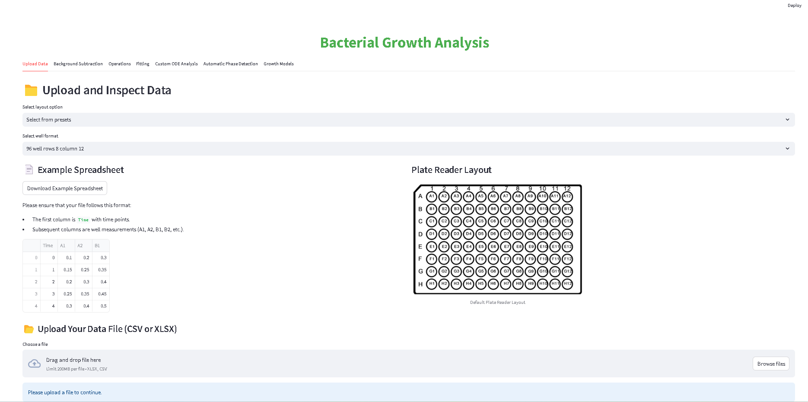
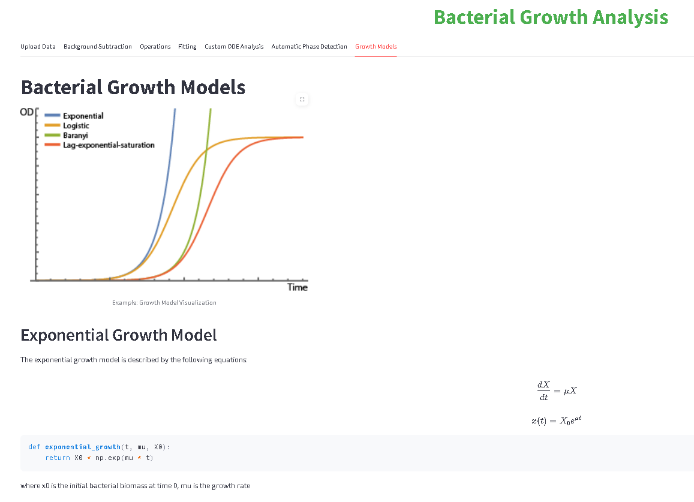

# 🧪 Bacterial Growth Analyzer

A modular **Streamlit-based web application** for analyzing bacterial growth from optical density (OD) measurements.  
Designed to handle **multiple well plate formats**, from 24 to 1536 wells, with background subtraction, phase detection, and customizable growth models.

---

## 📌 Features

- **Flexible Plate Layouts**: 24, 84, 96, or 1536-well plate formats, plus custom row/column definitions  
- **Interactive Well Selection**: Pick blanks & samples in a dynamic grid UI  
- **Multi-Group Background Subtraction**: Subtract blank wells in multiple groups  
- **Arithmetic Operations**: Perform Add/Sub/Mul/Div among multiple group data sets  
- **Automatic Phase Detection**: Thresholded derivative or slope-based methods (via Ruptures & signal processing)  
- **Curve Fitting**: Fit logistic, exponential, Baranyi, or custom models to OD/time data  
- **Custom ODE Solver**: Integrate your own ODE system, solve & display confidence intervals  
- **Confidence Intervals & Standard Deviations**: Visualize model-fitting uncertainty and replicate variability  
- **JSON Config**: Import or export project-wide configs for background subtraction or fitting phases

---

## 🚀 Quick Start

### 1. **Clone & Install**

```bash
git clone https://github.com/srinathlaka/bacterial-growth-analyzer.git
cd bacterial-growth-analyzer
pip install -r requirements.txt
```

### 2. **Run the App**

```bash
streamlit run app.py
```

- Open the local URL in your browser to access the app.
- You’ll see **tabbed** sections: **Upload Data**, **Background Subtraction**, **Operations**, **Fitting**, **Custom ODE Analysis**, **Phase Detection**, and **Growth Models**.

---

## 📁 Project Structure

```
bacterial-growth-analyzer/
├── app.py                     # Main Streamlit app (UI + workflow)
├── assets/                    # Images, example spreadsheets
├── data/                      # (Optional) For user-uploaded or temp data
├── tabs/
│   ├── tab_upload.py
│   ├── tab_background.py
│   ├── tab_operations.py
│   ├── tab_fitting.py
│   ├── tab_ode_analysis.py
│   ├── tab_phase_detection.py
│   └── tab_growth_models.py
├── utils/
│   ├── file_io.py
│   ├── background.py
│   ├── operations.py
│   ├── fitting.py
│   ├── ode_analysis.py
│   ├── phase_detection.py
│   ├── plotting.py
│   └── models.py
├── .gitignore
├── requirements.txt
├── LICENSE
└── README.md
```

Each **tab** file handles a specific UI section (Upload, Background, Operations, etc.).  
Each **utils** file contains reusable logic, such as file reading, background subtraction, or ODE analysis.

---

## 📊 How to Use

1. **Upload Data**  
   - **Tab 1**: Upload `.csv` or `.xlsx` files with time + well data.  
   - Select your plate layout (rows × columns) and confirm the raw data.

2. **Background Subtraction**  
   - **Tab 2**: Assign blank & sample wells for multiple groups.  
   - Subtract blank means for correct baseline.  
   - Fit polynomial/exponential to blank wells if desired.

3. **Operations**  
   - **Tab 3**: If multiple groups exist, you can add/subtract/multiply/divide them.  
   - Merged results become **“operated_data”** for further analysis.

4. **Fitting**  
   - **Tab 4**: Fit logistic, exponential, Baranyi, or custom models.  
   - Use confidence intervals & standard deviation plots.  
   - Optionally load a JSON config for advanced multi-interval setups.

5. **Custom ODE Analysis**  
   - **Tab 5**: Define variables + ODE expressions, solve them over intervals.  
   - Fit ODE parameters to your data with confidence intervals if a covariance matrix is computed.

6. **Phase Detection**  
   - **Tab 6**: Automatic detection via thresholded derivative or slope-based approach.  
   - Visualize and highlight detected phases on an OD vs. Time plot.

7. **Growth Models**  
   - **Tab 7**: Reference standard growth equations (exponential, logistic, etc.) with code examples.

---

## 🖼 Screenshots

### Home Screen


### Growth Models Tab


---

## 🧪 Example Use Cases

- Bacterial growth curve analysis
- Antibiotic screening or synergy tests
- Monitoring OD-based fermentation
- Educational demos on logistic vs. exponential growth

---

## 👨‍💻 Tech Stack

- **[Streamlit](https://streamlit.io/)** – UI + reactive data flow  
- **[NumPy](https://numpy.org/)** + **[Pandas](https://pandas.pydata.org/)** – Data manipulation  
- **[SciPy](https://scipy.org/)** – curve_fit, solve_ivp, stats, optimize  
- **[Plotly](https://plotly.com/python/)** – Interactive charts  
- **[Ruptures](https://centre-borelli.github.io/ruptures-docs/)** – Change point detection  
- **Python 3.8+** recommended

---

## 📄 License

This project is licensed under the **MIT License**. See [LICENSE](LICENSE) for details.

---

## 🤝 Contributing

Contributions are welcome!  
1. **Fork** the repository  
2. **Create** a new branch (`git checkout -b feature/something`)  
3. **Commit** your changes (`git commit -m 'Add new feature'`)  
4. **Push** to the branch (`git push origin feature/something`)  
5. **Open** a Pull Request

---

## 🌐 Author

**Srinath Laka**  
Master’s in Scientific Instrumentation at Ernst Abbe Hochschule (EAH) Jena  
- **GitHub**: [srinathlaka](https://github.com/srinathlaka)  

Email: srinathlaka1@gmail.com
